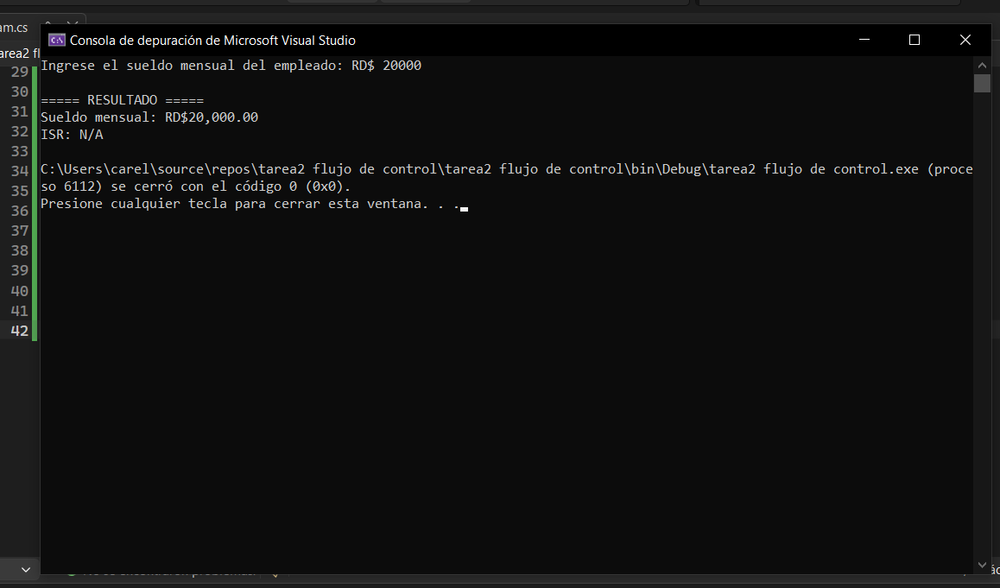
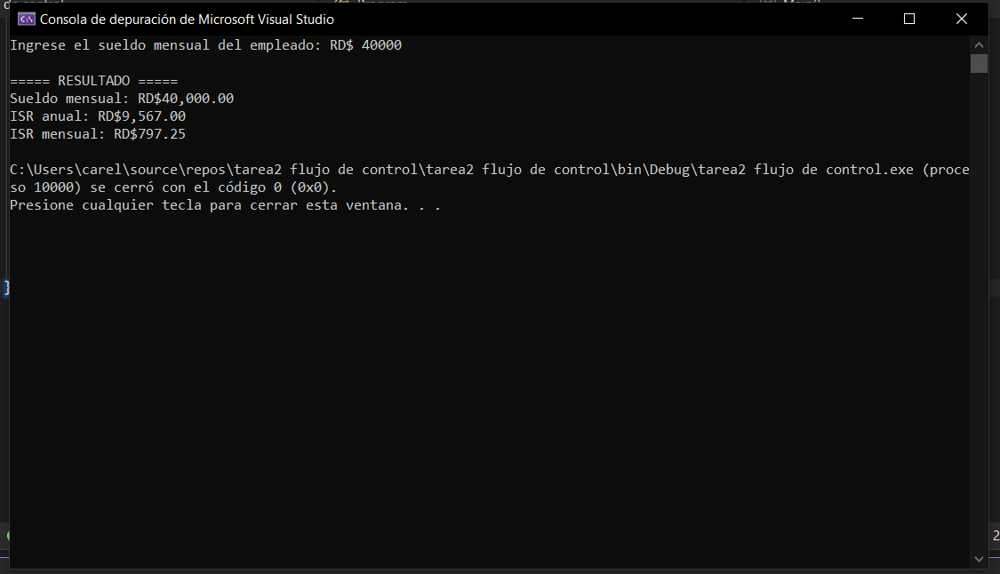
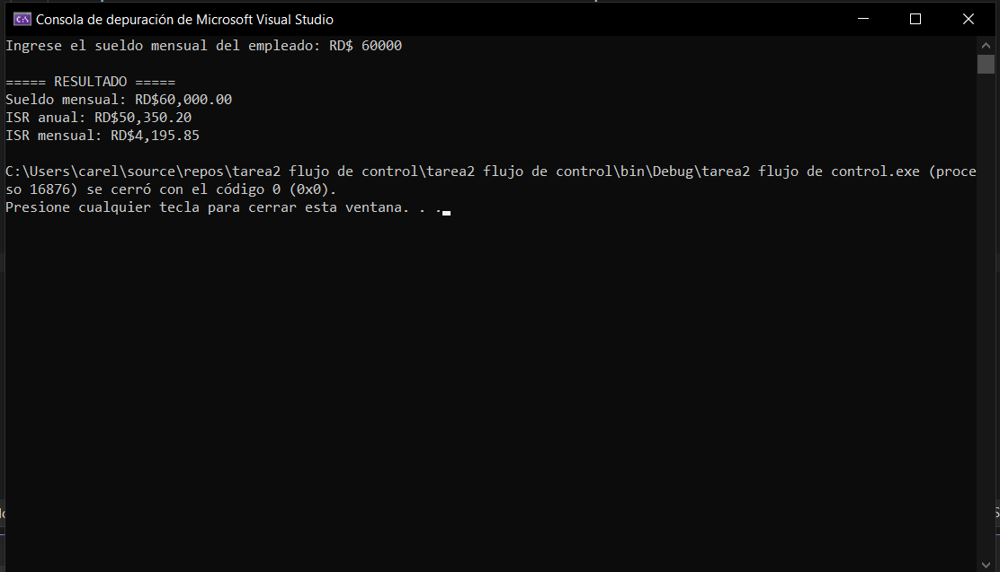
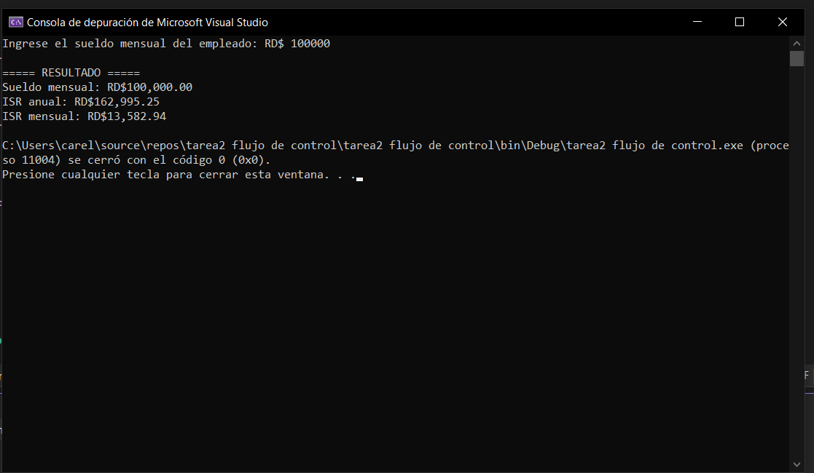

# Tarea 2 - Flujo de Control


---

# Descripción

Este proyecto consiste en desarrollar un programa en C# que calcula el Impuesto Sobre la Renta (ISR) de un empleado utilizando las escalas salariales vigentes de la Dirección General de Impuestos Internos (DGII) de la República Dominicana.

El programa solicita el sueldo mensual del empleado, calcula el sueldo anual, determina el rango correspondiente y muestra el ISR anual y mensual. Si el empleado está exento del impuesto, el programa muestra **N/A**.

---

# Objetivo

Aplicar estructuras de control (`if`, `else if` y `else`) para resolver un problema real mediante la evaluación de diferentes rangos salariales y el cálculo automático del ISR.

---

# Tecnologías utilizadas

- C#
- .NET
- Visual Studio
- Git
- GitHub

---

# Funcionamiento

1. El usuario introduce el sueldo mensual.
2. El programa calcula el sueldo anual.
3. Se compara el sueldo anual con los rangos del ISR.
4. Se calcula el impuesto correspondiente.
5. Se muestra el ISR anual y el ISR mensual.
6. Si el empleado está exento, el programa muestra **N/A**.

---

# Casos de prueba

## Caso 1 - Empleado exento de ISR

### Entrada

```
30000
```

### Resultado esperado

```
Sueldo mensual: RD$30,000.00
ISR: N/A
```

### Captura



---

## Caso 2 - Primer rango (15%)

### Entrada

```
40000
```

### Captura



---

## Caso 3 - Segundo rango (20%)

### Entrada

```
60000
```

### Captura



---

## Caso 4 - Tercer rango (25%)

### Entrada

```
90000
```

### Captura



---

# Explicación del código

El programa solicita al usuario el sueldo mensual del empleado y calcula el sueldo anual multiplicándolo por doce.

Posteriormente utiliza una estructura de decisión (`if`, `else if` y `else`) para determinar el rango salarial correspondiente según las escalas del ISR de la DGII.

Dependiendo del rango en que se encuentre el sueldo anual, el programa calcula el impuesto utilizando la fórmula correspondiente.

Finalmente muestra el sueldo mensual ingresado, el ISR anual y el ISR mensual. Si el sueldo está exento del impuesto, el programa muestra **N/A**.

---


